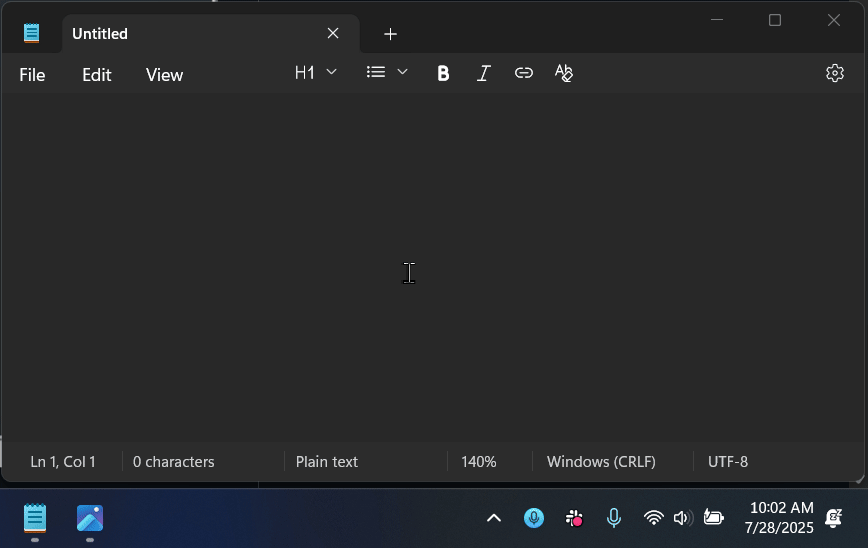

# Voice Typing Assistant

A lightweight Python desktop app for Windows that improves upon Windows Voice Typing (Win+H) by offering superior transcription accuracy and the ability to navigate between windows while recording, all while maintaining a simple, intuitive interface.



## Overview

How it works:
- Press Caps Lock to begin recording your voice (without activating Caps Lock)
- A recording indicator with audio level appears in the top-right corner
- Press Caps Lock again to stop recording and process the audio
- The audio is sent to OpenAI Whisper for transcription
- (optional) The transcribed text is further refined using a quick LLM model
- The transcribed text is inserted at your current cursor position in any text field or editor

## Features

### RecordingControls
- **Toggle Recording**: Caps Lock (normal Caps Lock functionality still available with Ctrl+Caps Lock)
- **Cancel Recording**: Click the recording indicator

### Tray Options/Settings
- Left-click tray icon to copy last transcription
- Recent Transcriptions: Access previous transcriptions, copy to clipboard
- Microphone Selection: Choose your preferred input device
- Settings:
  - Continuous Capture: Default recording mode. Record audio until the user stops it, send it all at once to OpenAI Whisper
  - Clean Transcription: Enable/disable further refinement of the transcription using Claude 3.5 Haiku
  - Auto-Stop on Silence: Automatically stop recording after a period of silence
- Restart: Quickly restart the application, like when its not responding to the keyboard shortcut

### Tray History
- Keeps track of recent transcriptions
- Useful if your cursor was in the wrong place at the time of insertion
- Quick access to copy previous transcriptions from system tray

## Technical Details
- Minimal UI built with Python tkinter
- OpenAI Whisper API for transcription (will support other providers in the future)
- For now, only tested on Windows OS and Python 3.8+

## Current Limitations
- ⚠️ Maximum recording duration of ~10 minutes per transcription due to OpenAI Whisper API's 25MB file size limit

## Setup/Installation - For Users

### Quick Start (Windows)

* Requires Python 3.8 or higher (check with `python --version`) - get from [python.org](https://python.org)
* Requires `uv` CLI tool (check with `uv --version`) - get from [uv installation guide](https://docs.astral.sh/uv/getting-started/#installation)

1. Download this project by clicking the green "Code" button at top of page → "Download ZIP" or clone the repo
2. Extract the ZIP file to a location of your choice
3. Run `setup.bat` from Command Prompt or PowerShell:
   - Note: while you *can* just double on the `setup.bat` file to run the setup, running from terminal prevents the window from auto-closing if errors occur
   - Open Command Prompt or PowerShell; Navigate to the folder: `cd "path\to\extracted\better-voice-typing"`
   - Run: `setup.bat` (Command Prompt) or `.\setup.bat` (PowerShell)
   - This will create a virtual environment, install packages, and set up default configuration
4. Open the `.env` file in Notepad, update the following and save:
   - OpenAI API key ([get one here](https://platform.openai.com/api-keys))
   - (Optional) Anthropic API key for text cleaning
5. Launch the application by double-clicking the `run_voice_typing.bat` file in the application folder
6. Ensure the app's tray icon is visible by right-clicking the taskbar → "Taskbar settings" → "Select which icons appear on the taskbar" → Toggle on for Voice Typing Assistant
7. **Recommended**: Right-click `run_voice_typing.bat` → Send to → Desktop to create a shortcut

**(Optional) Configure a different model to use for transcript cleaning**

- After running the app once, a `settings.json` file will be created
- Open this file in Notepad or any text editor
- Find the `"llm_model": "openai/gpt-4o-mini"` line
- Set it to your [preferred provider/model](https://docs.litellm.ai/docs/providers), using the LiteLLM format `"provider/model-name"`, for example:
   - For Grok: `"llm_model": "groq/llama3-8b-8192"`
   - For Claude: `"llm_model": "anthropic/claude-3-5-haiku-latest"`
- Save the file and restart the application

### Auto-start with Windows
To make the app start automatically when Windows boots:
1. Press `Win + R` on your keyboard
2. Type `shell:startup` and press Enter
3. Create a shortcut to `run_voice_typing.bat` in this folder:
   - Right-click `run_voice_typing.bat` → "Copy"
   - Navigate to the startup folder
   - Right-click in an empty area → "Paste shortcut" (might be under more options)

### Updating the App
To update to the latest version:
1. Open Command Prompt or PowerShell
2. Navigate to the folder: `cd "path\to\better-voice-typing"`
3. Run: `setup.bat` (Command Prompt) or `.\setup.bat` (PowerShell)
4. Choose 'Y' when asked to check for updates
5. The tool will automatically:
   - Download the latest version
   - Preserve your settings and API keys
   - Update all dependencies
6. Restart the app if it was running

## Setup/Installation - For Developers

1. Clone the repo
2. Ensure you have `uv` installed (see [uv installation guide](https://docs.astral.sh/uv/getting-started/#installation))
3. Create a virtual environment with `uv venv --python ">=3.8"`
4. Activate with `.venv\Scripts\activate`
5. Install dependencies with `uv pip install -r requirements.txt`
6. Create a `.env` file based on `.env.example` by running `cp .env.example .env`
7. Set up your API keys:
   - Get an OpenAI API key from [OpenAI's API Keys page](https://platform.openai.com/api-keys)
   - (Optional) Get an Anthropic API key if you want to use the text cleaning feature
   - Add these keys to your `.env` file
8. Run the app from the command line:
   ```
   .\.venv\Scripts\python.exe .\voice_typing.pyw
   ```
9. For debugging: Add the `--debug` flag when executing:
   ```
   .\.venv\Scripts\python.exe .\voice_typing.pyw --debug
   ```

## TODO
- [x] Migrate to `uv` for dependency and environment management
- [x] Migrate to LiteLLM as wrapper to support other LLM providers.
- [x] Handling for the `settings.json` file, so I'm not committing changes to mine.
- [x] Review and validate setup and installation process
- [ ] Add support for OpenAI's [new audio models](https://platform.openai.com/docs/guides/audio)
- [ ] Add support for more speech-to-text providers (might be possible via LiteLLM?)
- [ ] Some warning or auto-stop if recording duration is going to be too long (due to API limits)
- [ ] Update and improve README.md
- [ ] Customizable activation shortcuts for recording control
- [ ] Improved transcription accuracy via VLM for code variables, proper nouns and abbreviations using screenshot context and cursor position
- [ ] ~~Smart Capture: Record audio in 1-2 minute chunks with silence detection, process chunks with Whisper in background, then combine and clean results with an LLM~~

## Changelog

### v0.5.2 (2025-03-21)
- Added `run_voice_typing.bat` for easier application launching
- Tested and improved update process (run `setup.bat` and choose 'Y' when asked to check for updates)
- Refined text cleaning prompt for better transcription cleaning on smaller models

### v0.5.1 (2025-03-21)
- Added version tracking and changelog
- You now just need an OpenAI API key for full functionality
- Migrated to LiteLLM for multi-provider/model support: you can use any model you want for text cleaning
- Fixed settings.json initialization and handling
- Fixed `setup.bat` based setup process, improved error handling

## Contributing

TBD, for now, just create a pull request and start a conversation.

## License

This project is licensed under the MIT License - see the [LICENSE](LICENSE) file for details.